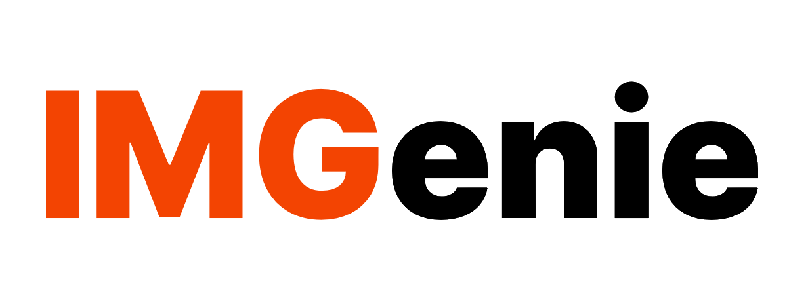
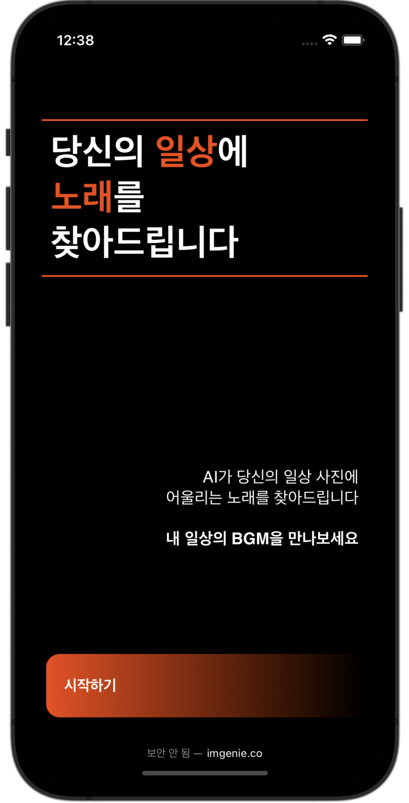
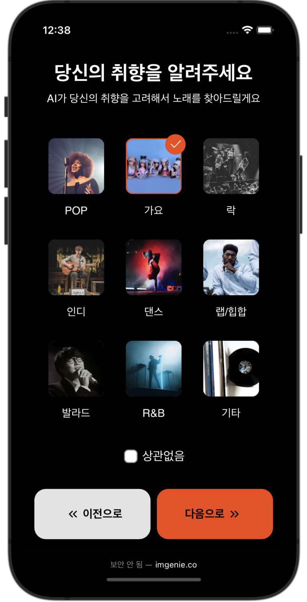
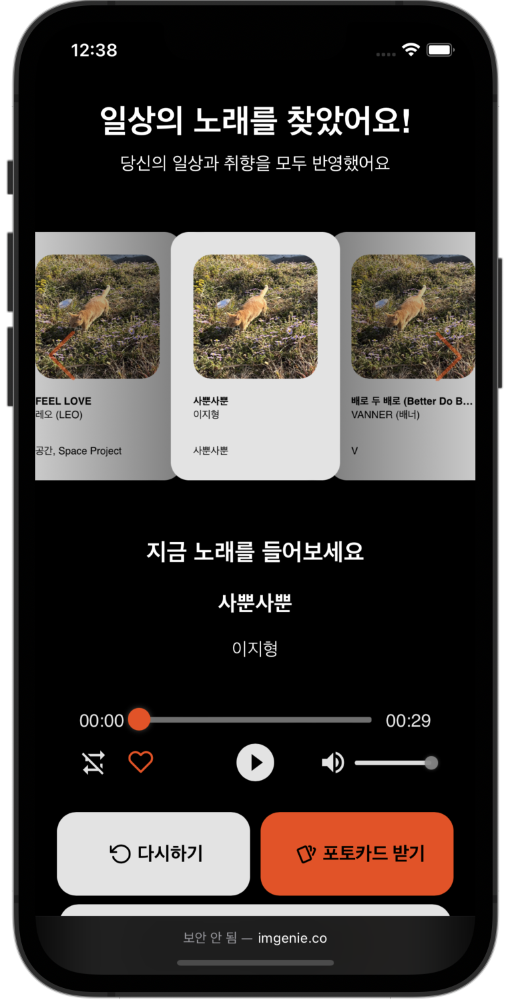
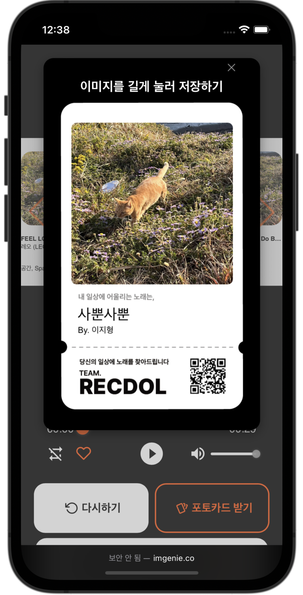
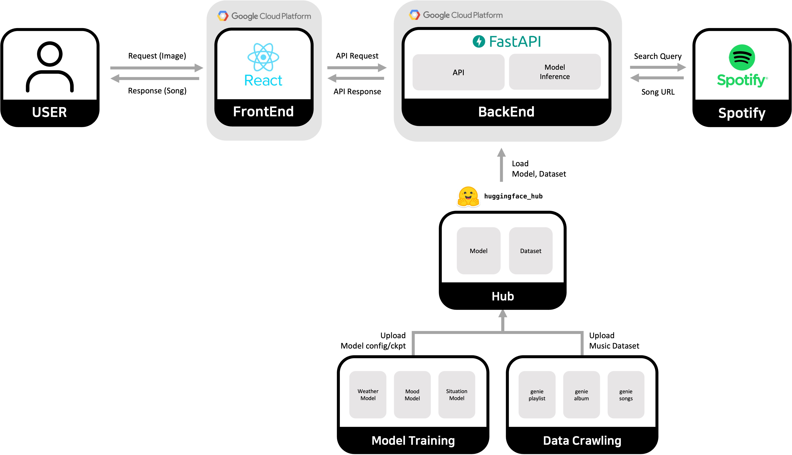
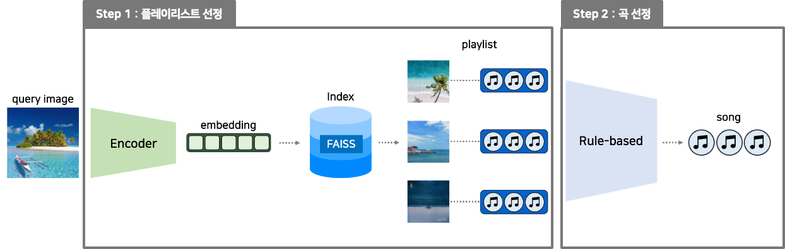

<div align="center">
  <br>
  <picture>
    <source srcset="./docs/imgs/IMGenie_logo_white.png" media="(prefers-color-scheme: dark)">
    
  </picture>
  
  <h2>당신의 일상에 노래를 찾아드립니다</h2></hr>
  <h3>👉 <a href="http://IMGenie.co">IMGenie.co</a> 👈</h3>
  <p align="center">
    
    
    
    
    
    
    
  </p>
</div>
<br>

## 프로젝트 설명

<strong>IMGenie</strong>는 일상의 사진을 토대로 어울리는 음악을 추천해주는 서비스입니다 🎧  
이미지를 개시하면 분위기, 상황, 날씨를 고려해 어울리는 노래를 추천해줍니다  
<a href="https://youtu.be/mlpkmxorWVs">시연 영상 </a>

<div align="center">




</div>

## 프로젝트 아키텍쳐

<p align="center"><strong>⚙️ 서비스 아키텍쳐 ⚙️</strong></p>



---

<p align="center"><strong>⚙️ 모델 아키텍쳐 ⚙️</strong></p>



## 개발 환경 설정

### Pre-Commit 설정

```bash
pip install pre-commit
pre-commit install
```
